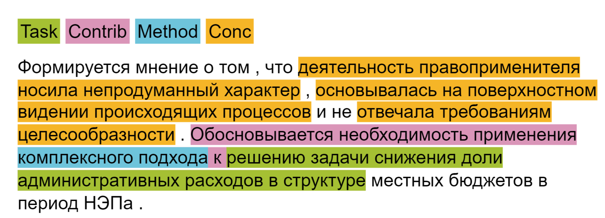

# Automatic aspect extraction from scientific texts in Russian

- This project is part of the [TERMinator (Tool for Information extraction from Russian texts)](https://github.com/iis-research-team/terminator).
- [Here](https://github.com/iis-research-team/ruserrc-dataset/tree/master/ruserrc_aspects) you can find the dataset, on which the models were trained.

## Examples

Example of automatic annotation (`tag_annotator.annotate_with_colors`)


Abother example of automatic annotation (`extractor.print_extracted_aspects`)

```
ЗАДАЧА
1. Восстановление коэффициентов системы линейных разностных уравнений
ВКЛАД
1. Восстановление коэффициентов системы линейных разностных
2. Доказана сходимость и установлены оценки скорости сходимости метода
МЕТОД
1. Модификация метода обратной итерации
```

## Module description:
- `data_loader.py`: loads dataset from csv-files 
- `model.py`: creates a model
- `vectorizer.py`: vectorizes texts and labels
- `trainer.py`: used for training the model
- `predictor.py`: extracts aspects from texts
- `evaluator.py`: counts metrics for predictions
- `tag annotator.py`: annotates texts with predicteg aspects
- `aspect_extractor.py`: outputs extracted aspects and normalizes them
- `utils.py`: contains some constants, variables and functions 
- `models.json`: contains configs for different models
- `train_config.json`: contains training configurations
- `cross-domain-pipeline.json`: used for cross-domain experiments
